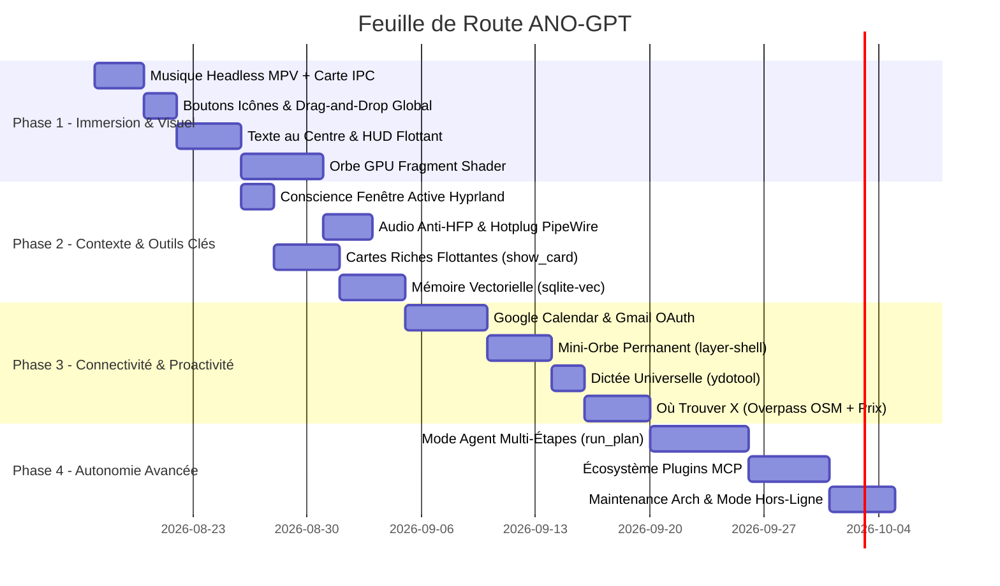

# 🌟 ANO-GPT — Catalogue Complet des Fonctionnalités & Améliorations

> **Document de Référence & Feuille de Route Stratégique**  
> Ce document recense l'ensemble des améliorations et fonctionnalités à apporter à **ANO-GPT** pour en faire un assistant IA autonome de type « JARVIS réel », ultra-fluide et parfaitement ancré dans l'écosystème **Linux (Arch Linux / Hyprland / Wayland / PipeWire)** avec **Gemini Live**.

---

## 🧭 Matrice Synthétique : Impact vs Priorité

| Priorité | Fonctionnalité | Domaine | Impact | Complexité |
| :--- | :--- | :--- | :--- | :--- |
| **P0** | **Musique 100 % intégrée (MPV Headless IPC)** | Audio / UI | 🔴 Énorme | 🟡 Moyenne |
| **P0** | **Texte au centre & HUD Flottant Translucide** | Interface | 🔴 Énorme | 🟡 Moyenne |
| **P0** | **Orbe Réactif GPU (Shader GLSL + FFT)** | Immersion | 🔴 Énorme | 🔴 Difficile |
| **P0** | **Conscience d'écran continue (Active Window)** | Intelligence | 🔴 Énorme | 🟢 Facile |
| **P0** | **Boutons icônes & Drag-and-Drop Global** | Ergonomie | 🟠 Fort | 🟢 Facile |
| **P1** | **Gestion Audio & Micro Intelligente (Anti-HFP)** | Audio / Matériel | 🔴 Énorme | 🟡 Moyenne |
| **P1** | **Mémoire Vectorielle Sémantique (`sqlite-vec`)** | Intelligence | 🔴 Énorme | 🟡 Moyenne |
| **P1** | **Mini-Orbe Compagnon Permanent (`layer-shell`)**| Immersion / OS | 🔴 Énorme | 🟡 Moyenne |
| **P1** | **Système de Cartes Riches Flottantes (`show_card`)**| Interface | 🟠 Fort | 🟡 Moyenne |
| **P1** | **Mode Agent Autonome Multi-Étapes (`run_plan`)**| Automatisation | 🔴 Énorme | 🔴 Difficile |
| **P1** | **Google Calendar & Planification Vocale** | Productivité | 🟠 Fort | 🟡 Moyenne |
| **P1** | **Gmail Sécurisé (Lecture & Notifications)** | Productivité | 🟠 Fort | 🟡 Moyenne |
| **P1** | **Dictée Vocale Universelle Système (`ydotool`)** | Ergonomie / OS | 🟠 Fort | 🟢 Facile |
| **P1** | **« Où Acheter X » (Overpass OSM + Prix Web)** | Vie Pratique | 🟠 Fort | 🟡 Moyenne |
| **P1** | **RAG Documentaire Personnel Local** | Connaissance | 🟠 Fort | 🟡 Moyenne |
| **P2** | **Minuteurs & Comptes à Rebours Visuels** | Quotidien | 🟠 Fort | 🟢 Facile |
| **P2** | **Routines & Macros Vocales Déclenchables** | Automatisation | 🟠 Fort | 🟢 Facile |
| **P2** | **Intégration Smartphone (KDE Connect D-Bus)** | Connectivité | 🟠 Fort | 🟡 Moyenne |
| **P2** | **Écosystème Plugins Client MCP** | Extensibilité | 🔴 Énorme | 🟡 Moyenne |
| **P2** | **Identification Vocale du Locuteur (Speaker ID)**| Sécurité | 🟡 Moyen | 🟡 Moyenne |
| **P2** | **Sentinelle & Maintenance Arch Linux** | Système | 🟡 Moyen | 🟢 Facile |
| **P2** | **Mode Hors-Ligne Dégradé (Vosk + Ollama + Piper)**| Résilience | 🟠 Fort | 🔴 Difficile |
| **P2** | **Résumé YouTube & Articles à la volée** | Productivité | 🟡 Moyen | 🟢 Facile |
| **P3** | **Veille de Prix & Actualités Proactive** | Quotidien | 🟡 Moyen | 🟢 Facile |
| **P3** | **Transcription & Prise de Notes de Réunion** | Productivité | 🟡 Moyen | 🟡 Moyenne |
| **P3** | **Bilan de Fin de Journée & Journal de Bord** | Confort | 🟡 Moyen | 🟢 Facile |
| **P3** | **Génération d'Images & Visualisations Graphiques**| Créativité | 🟡 Moyen | 🟢 Facile |

---

## 🔴 NIVEAU 1 — PRIORITÉ P0 : Les Piliers Fondamentaux (Effet Immédiat)

### 1. 🎵 Musique 100 % Intégrée (Lecteur Headless MPV + Socket IPC)
* **Problème résolu** : Le lancement de musique ouvrait une fenêtre VLC/MPV externe brisant le flux et l'immersion.
* **Fonctionnalités** :
  * Lancement en arrière-plan sans aucune fenêtre (`--no-video`, `--force-window=no`).
  * Pilotage instantané par socket JSON IPC (`core/player_ipc.py`) : lecture, pause, seek, volume, playlist, métadonnées.
  * Carte lecteur dédiée dans l'interface (pochette/thumbnail YouTube, titre défilant, barre de progression interactive, contrôles souris et voix).
  * Enchaînement de file d'attente fluide (*"Mets aussi ce morceau après"*).
* **Impact** : Expérience multimédia invisible et digne d'un majordome.

### 2. 🌌 Interface Flottante & Rendu du Texte au Centre
* **Problème résolu** : Fin du layout dashboard 3 colonnes rigide avec un journal console sur le côté.
* **Fonctionnalités** :
  * L'orbe occupe tout le champ visuel central.
  * Les réponses de l'IA apparaissent au centre sous l'orbe en typographie soignée avec animations fluides d'apparition/disparition.
  * Tous les éléments deviennent des **panneaux flottants translucides** (`FloatingPanel`) qui ne s'affichent que lorsqu'ils ont du contenu (lecteur musique, météo, alertes).
* **Impact** : L'interface passe d'un tableau de bord applicatif à un véritable HUD holographique.

### 3. 🔮 Orbe Réactif GPU (Fragment Shader GLSL + Analyse FFT)
* **Problème résolu** : L'orbe actuel est calculé sur le CPU avec `QPainter`, consommant des ressources et manquant d'organicité.
* **Fonctionnalités** :
  * Rendu fragment shader GPU (via `QOpenGLWidget` ou scène Qt Quick QML).
  * Réactivité audio par calcul FFT (ondes réactives aux fréquences graves/médiums/aigus de la voix).
  * Machine à états vivante : *respiration au repos*, *frémissement à l'écoute*, *rotation à la réflexion*, *ondulations à la parole*, *arcs électriques lors des actions outils*.
* **Impact** : Donne une présence physique vivante et moderne à l'assistant.

### 4. 👁️ Conscience d'Écran Continue (Active Window Awareness)
* **Problème résolu** : L'assistant ne savait pas ce que vous faisiez sans capture manuelle.
* **Fonctionnalités** :
  * Boucle légère lisant en continu la fenêtre active via `hyprctl activewindow` (titre, classe, workspace).
  * Injection automatique dans le prompt système dynamique de Gemini Live.
  * Capacité de répondre instantanément à *"De quoi parle ce fichier ?"*, *"Aide-moi sur cette erreur"* sans contexte explicite préalable.
* **Impact** : L'IA comprend votre environnement de travail en direct avec un coût CPU quasi nul.

---

## 🟠 NIVEAU 2 — PRIORITÉ P1 : Intelligence, Contexte & Utilitaires Majeurs

### 5. 🎧 Gestion Audio & Micro Intelligente (Anti-HFP & Hot-Plug)
* **Problème résolu** : Les écouteurs Bluetooth basculant en profil mains-libres dégradé (16 kHz mono) lors de l'activation du micro.
* **Fonctionnalités** :
  * Routage PipeWire intelligent : maintien de la sortie audio en A2DP haute fidélité tout en captant le micro du PC ou externe.
  * Détection de branchement/débranchement à chaud (AirPods, micro USB) sans redémarrer l'application.
  * Module d'annulation d'écho PipeWire (`module-echo-cancel`) pour une interruption vocale parfaite pendant que l'IA parle.

### 6. 🧠 Mémoire Vectorielle Sémantique (`sqlite-vec`)
* **Problème résolu** : Remplacement de la mémoire clé-valeur JSON superficielle.
* **Fonctionnalités** :
  * Base vectorielle locale légère sans serveur externe.
  * Stockage sémantique des projets passés, préférences de développement, faits appris et résumés de sessions.
  * Recherche par similarité vectorielle : injection ciblée des 3 à 5 faits les plus pertinents pour chaque conversation.

### 7. 🪟 Mini-Orbe Compagnon Permanent (`wlr-layer-shell`)
* **Problème résolu** : Besoin d'avoir l'assistant sous les yeux sans garder la grande fenêtre ouverte.
* **Fonctionnalités** :
  * Bulle compacte sans bordure (~80 px) incrustée en coin d'écran au-dessus de toutes les fenêtres.
  * Témoin d'état en temps réel (écoute / réflexion / parole) et affichage de réponses courtes sous forme de bulles éphémères.
  * Déclenchement micro au clic et bascule rapide vers la grande fenêtre.

### 8. 🗂️ Système de Cartes Riches Flottantes (`show_card`)
* **Problème résolu** : Remplacement du texte brut par des cartes visuelles interactives.
* **Fonctionnalités** :
  * Pile de cartes translucides glissant depuis le bord droit.
  * Types de cartes : Résultats de recherche web, fiches météo détaillées, emails récents, confirmations d'actions risquées (boutons Oui/Non), suivi de tâches.

### 9. 🤖 Mode Agent Autonome Multi-Étapes (`run_plan`)
* **Problème résolu** : Exécution d'actions uniques isolées sans planification.
* **Fonctionnalités** :
  * Traitement de requêtes complexes : *"Trouve un restaurant italien ouvert ce soir, vérifie la note et planifie un rappel à 19h"*.
  * Carte interactive de progression affichant les étapes qui se cochent en temps réel.
  * Garde-fous automatiques avec demande de confirmation vocale pour les actions sensibles.

### 10. 📅 Google Calendar & Planification Intelligente
* **Fonctionnalités** :
  * Authentification OAuth 2.0 sécurisée (clés chiffrées dans le trousseau système `keyring`).
  * Lecture de l'agenda, recherche de créneaux disponibles et alertes 10 minutes avant chaque événement.
  * Intégration dans le briefing matinal automatique.

### 11. ✉️ Intégration Gmail Sécurisée
* **Fonctionnalités** :
  * Accès en lecture seule restreint (`gmail.readonly`).
  * Détection en arrière-plan des nouveaux emails importants et résumé vocal concis.
  * Carte expéditeur/objet/extrait avec bouton d'ouverture directe dans le navigateur.

### 12. ⌨️ Dictée Vocale Universelle Système (`ydotool`)
* **Fonctionnalités** :
  * Mode dictée rapide : le flux vocal transcrit est saisi directement dans la fenêtre active (navigateur, terminal, éditeur).
  * Gestion de la ponctuation et des commandes de contrôle (*"à la ligne"*, *"efface le dernier mot"*).

### 13. 📍 « Où Trouver / Acheter X » (Overpass OSM + Comparateur Prix)
* **Fonctionnalités** :
  * Recherche spatiale des commerces à proximité via l'API Overpass OpenStreetMap (sans abonnement payant).
  * Croisement en direct avec la recherche de prix web.
  * Affichage sur carte Leaflet interactive avec calcul d'itinéraire et fiches commerces.

### 14. 📚 RAG Documentaire Personnel Local
* **Fonctionnalités** :
  * Indexation vectorielle en tâche de fond de vos répertoires clés (`~/Documents`, `~/OUTILS`).
  * Recherche en langage naturel dans vos PDF, Markdown, documents texte et code source (*"Retrouve la note sur l'architecture réseau"*).

---

## 🟡 NIVEAU 3 — PRIORITÉ P2 : Automatisation, Connectivité & Résilience

### 15. ⏱️ Minuteurs & Comptes à Rebours Visuels Multiples
* **Fonctionnalités** :
  * Minuteurs simultanés nommés (*"Minuteur cuisson 15 min"*, *"Pause 5 min"*).
  * Cartes de décompte animées, abaissement automatique du volume sonore (ducking) et alerte vocale à l'échéance.

### 16. ⚡ Routines & Macros Vocales Personnalisées
* **Fonctionnalités** :
  * Déclenchement de séquences d'actions par une phrase clé (*"Mode Travail"* $\rightarrow$ agencement des fenêtres Hyprland, lancement des outils, musique lofi, blocage des notifications).
  * Routines planifiées via `systemd` timers (briefing matinal, rappels réguliers).

### 17. 📱 Intégration Smartphone (KDE Connect D-Bus)
* **Fonctionnalités** :
  * Réception et lecture vocale des SMS et notifications du téléphone.
  * Envoi de SMS à la voix, localisation du téléphone (faire sonner) et surveillance de la batterie.
  * Détection de présence : mise en veille automatique de l'assistant si le téléphone quitte le réseau local.

### 18. 🔌 Écosystème Plugins Standard MCP (Model Context Protocol)
* **Fonctionnalités** :
  * Raccordement transparent de serveurs MCP tiers (GitHub, Notion, Docker, bases SQL, Spotify) sans développer de connecteurs sur-mesure.
  * Déclaration granulaire des permissions par plugin (fichiers, réseau, commandes).

### 19. 🗣️ Identification Vocale du Locuteur (Speaker Recognition)
* **Fonctionnalités** :
  * Empreinte vocale locale pour vérifier l'identité de l'utilisateur.
  * Bascule automatique en *Mode Invité* (accès restreint) si une voix inconnue est détectée.

### 20. 🛡️ Sentinelle & Maintenance Proactive Arch Linux
* **Fonctionnalités** :
  * Surveillance discrète de l'état système : paquets orphelins, espace disque critique (> 90 %), alertes de sécurité Arch, santé SMART des disques.
  * Commande *"Fais le ménage"* proposant un nettoyage sécurisé guidé des caches et journaux.

### 21. 🔌 Mode Hors-Ligne Dégradé (Survie Locale)
* **Fonctionnalités** :
  * En cas de coupure Internet : bascule automatique sur un pipeline local (Vosk STT + Ollama LLM + Piper TTS).
  * Maintien du contrôle système, du lancement d'applications, de la musique locale et des minuteurs sans connexion cloud.

### 22. 🎬 Résumé Vidéo YouTube & Pages Web à la Volée
* **Fonctionnalités** :
  * Récupération instantanée des sous-titres via `yt-dlp` sans téléchargement vidéo $\rightarrow$ synthèse structurée avec chapitrage cliquable.
  * Résumé en un éclair de la page web ouverte dans le navigateur.

---

## 🟢 NIVEAU 4 — PRIORITÉ P3 : Finitions, Confort & Créativité

### 23. 🏷️ Veille de Prix & Actualités Proactive
* **Fonctionnalités** :
  * Surveillance périodique de produits ciblés (*"Alerte-moi si ce GPU passe sous les 500 €"*).
  * Alertes visuelles et vocales dès que le seuil de prix est atteint.

### 24. 📝 Transcription & Prise de Notes de Réunion
* **Fonctionnalités** :
  * Enregistrement du flux audio système lors d'un appel ou d'une visio.
  * Transcription intégrale et génération d'un compte-rendu Markdown avec liste des actions à mener.

### 25. 🌙 Bilan de Fin de Journée & Journal de Bord
* **Fonctionnalités** :
  * Synthèse du soir : temps passé par projet, tâches cochées, points d'attention pour le lendemain.
  * Génération automatique d'un journal de bord quotidien au format Markdown.

### 26. 🎨 Génération d'Images & Visualisations Graphiques
* **Fonctionnalités** :
  * Génération d'images via Imagen/Gemini directement dans une carte d'action (boutons enregistrer, appliquer en fond d'écran).
  * Tracé de graphiques interactifs (télémétrie CPU/RAM historique, statistiques personnelles).

---

## 🗓️ Feuille de Route d'Implémentation Recommandée

---

## 🛡️ Règles d'Or Architecturales à Conserver

1. **Ne jamais casser Gemini Live** : La voix ultra-faible latence et bidirectionnelle repose sur Gemini Live. Les autres LLMs (Ollama, Claude) sont réservés aux tâches de secours ou de fond.
2. **Respect des contraintes Wayland / Hyprland** : Toujours utiliser le socket IPC pour les contrôles externes, valider l'état réel des fenêtres après un dispatch, et respecter le protocole layer-shell pour les overlays.
3. **Sécurité & Confidentialité** : Tokens OAuth stockés dans le trousseau système `keyring`, permissions explicites et confirmées pour toute commande shell ou action destructive.
